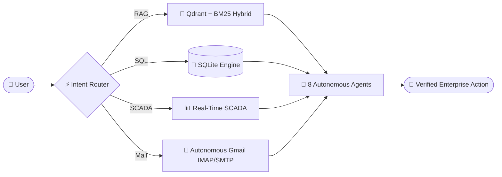

<div align="center">

<!-- Animated Header Banner -->
<a href="https://github.com/caglaryilmaz987">
  
</a>

<p align="center">
  <a href="https://linkedin.com/in/sebahittin-çağlar-yılmaz-008989197/"></a>
  <a href="https://github.com/caglaryilmaz987"></a>
  <a href="mailto:caglaryilmaz987@gmail.com"></a>
</p>

---

</div>

## 🧠 About Me

```yaml
developer:
  name: Sebahittin Çağlar Yılmaz
  role: AI & Software Engineer
  focus: Multi-Agentic Systems | Hybrid RAG Architectures | Computer Vision
  location: Istanbul, Turkey
  stack:
    ai_ml: [LangChain, LangGraph, LlamaIndex, Ollama, PyTorch, Transformers, Qdrant, RAGAS]
    backend: [Python, FastAPI, Java, C, SQLite, PostgreSQL]
    frontend: [React, JavaScript, Streamlit, Tailwind CSS]
    tools: [Docker, FastMCP, Git, Linux, CUDA]
```

- 🚀 **Currently Building:** Enterprise-grade 100% Local Multi-Agent RAG platforms with zero cloud dependency.
- 🔬 **Research Focus:** Hybrid retrieval (Dense + Sparse BM25 + Reciprocal Rank Fusion) and Cross-Encoder Reranking evaluated via RAGAS.
- 🎓 **Achievement:** Built production offline RAG system for **Microsoft Summer School 2026** (Foundry Local SDK).
- 💬 **Ask me about:** Multi-Agent Orchestration, Vector Search, Computer Vision, FastMCP, and Java Desktop Applications.

---

## ⚡ Tech Stack & Ecosystem

<div align="center">

### 🤖 Artificial Intelligence & LLM Frameworks
[](https://python.org)
[](https://pytorch.org)
[](https://langchain.com)
[](https://ollama.com)
[](https://huggingface.co)
[](https://opencv.org)
[](https://qdrant.tech)

### 💻 Core Languages & Frameworks
[](https://java.com)
[](https://iso.org)
[](https://fastapi.tiangolo.com)
[](https://streamlit.io)
[](https://react.dev)
[](https://developer.mozilla.org)
[](https://tailwindcss.com)

### ⚙️ Databases & DevOps Tools
[](https://sqlite.org)
[](https://mysql.com)
[](https://docker.com)
[](https://nvidia.com)
[](https://git-scm.com)

</div>

---

## 🚀 Flagship Projects Showcase

### 🏢 1. [Enterprise Multi-Agentic RAG Platform](https://github.com/caglaryilmaz987/Enterprise-Multi-Agentic-Rag-platform)
> **100% Local, Zero-Cloud Enterprise AI Platform with Autonomous Multi-Agent Orchestration**



- **Features:** 8 Autonomous AI Agents, 11 FastMCP Tools, SCADA Telemetry & GIS Integration, Local SD-Turbo image generation.
- **Tech Stack:** `Python`, `FastAPI`, `LangGraph`, `Streamlit`, `Ollama (Qwen2.5/LLaVA)`, `Qdrant`, `SQLite`, `Docker`.

<br/>

### 🔍 2. [Semantic RAG Pipeline with Hybrid Retrieval](https://github.com/caglaryilmaz987/Semantic-RAG-Pipeline-with-Hybrid-Retrieval)
> **Production-Grade Offline Hybrid RAG System (Microsoft Summer School 2026)**

- **Architecture:** Dense Vector Search (`Qwen3-Embedding`) + Sparse Keyword Search (`BM25Okapi`) fused via Reciprocal Rank Fusion ($k=60$) & Cross-Encoder reranking on **NVIDIA CUDA GPU**.
- **Metrics:** Evaluated end-to-end with **RAGAS** framework for sub-20ms latency and high precision.
- **Tech Stack:** `Python`, `Microsoft Foundry Local SDK`, `Phi-3.5-mini`, `BAAI Cross-Encoder`, `Streamlit`.

<br/>

### 💼 3. [Accounting Management System](https://github.com/caglaryilmaz987/Accounting_Manegement_System)
> **Enterprise Desktop Accounting Software**

- **Features:** Double-entry bookkeeping, transaction management, categorized reporting, secure MySQL integration.
- **Tech Stack:** `Java`, `Java Swing`, `MySQL`.

<br/>

### 🛍️ 4. [Meat Sales E-Commerce Showcase](https://github.com/caglaryilmaz987/Meat-Sales-Site-Demo)
> **Modern Minimalist E-Commerce Interface**

- **Features:** Responsive product catalog, cart system, fast filtering, modern dark UI styling.
- **Tech Stack:** `React`, `JavaScript`, `Tailwind CSS`.

---

<div align="center">

### 🤝 Let's Connect & Collaborate!

<p align="center">
  <a href="https://linkedin.com/in/sebahittin-çağlar-yılmaz-008989197/">
    
  </a>
  <a href="https://github.com/caglaryilmaz987">
    
  </a>
  <a href="mailto:caglaryilmaz987@gmail.com">
    
  </a>
</p>

<sub>Designed with ❤️ by **Sebahittin Çağlar Yılmaz**</sub>

</div>
